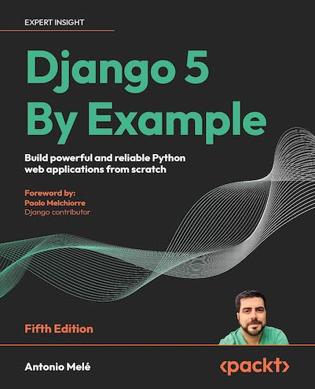

# Jesus Blog - A Django 5 Application ✝️📖

This is a simple blog application built with **Django 5** to share inspirational posts, devotionals, and reflections based on the teachings of **Jesus Christ**. The project is designed to help users create, read, update, and delete posts (CRUD functionality) while promoting the message of faith, hope, and love. ❤️

### Features ✨
- **User Authentication**: Users can sign up, log in, and log out to manage their posts. 🔐
- **Post Management**: Users can create, edit, and delete blog posts based on their reflections or teachings about Jesus. ✍️
- **Comments Section**: Readers can leave comments on each post to engage in discussions. 💬
<!-- - **Categories & Tags**: Posts can be organized into categories (e.g., Bible Studies, Devotionals, Sermons) and tagged with relevant keywords (e.g., Grace, Faith, Love). 🏷️ -->
- **Responsive Design**: Built with mobile-first principles to ensure a seamless experience across devices. 📱💻

### Tech Stack 🛠️
- **Backend**: Django 5 (Python-based web framework) 🐍
- **Frontend**: HTML, CSS (with a basic responsive design) 🌐
- **Database**: SQLite (default for development) 💾
- **Authentication**: Django's built-in authentication system 🔑
<!-- - **Deployment**: Can be deployed using services like Heroku, DigitalOcean, etc. 🚀 -->

### Click [here](https://www.amazon.com/Django-Example-powerful-reliable-applications/dp/1805125451) for Amazon Link:

 

