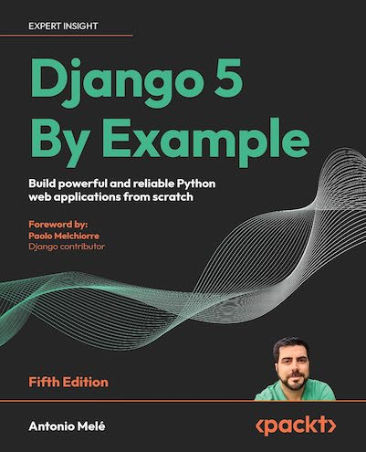

# Jesus Blog - A Django 5 Application ✝️📖

This is a simple blog application built with **Django 5** to share inspirational posts, devotionals, and reflections based on the teachings of **Jesus Christ**. The project is designed to help users create, read, update, and delete posts (CRUD functionality) while promoting the message of faith, hope, and love. ❤️ Visit [here!](https://eniolakunle.pythonanywhere.com/blog/)

### Features ✨

- **Endless Scrolling**: Scroll to your hearts desire and find the perfect article for your situation. 📜
- **Comments Section**: Readers can leave comments on each post, and share any page through the [Web Share API](https://developer.mozilla.org/en-US/docs/Web/API/Web_Share_API). 💬
- **Responsive Design**: Built with mobile-first principles to ensure a seamless experience across devices. 📱💻
  - **Dark/Light Mode Support**: Dynamically adjusts according to device preference! 🌗
  - **More Articles on Bigger Screens**: Bigger screens are filled with more articles to choose from. 🧐
- **CAPTCHA Verification**: Implemented via [django-simple-captcha](https://django-simple-captcha.readthedocs.io/en/latest/) to distinguish between real users and bots. 🔒
- **Fun Effects**: A few effects that give a pleasant feeling when looking at article previews. 🤪
  - **Card Effect**: Article previews mimic a playing card. 🃏
  - **Hover Effect**: Article previews float when in view of user. 🧞‍♂️
  - **Transition Effect**: A slick transition, implemented via JavaScript, for seamless site navigation! 🔥
- **Splash Page**: A colorful splash page for first time visitors! 💦 **Tip: Clear localStorage to get splashed again.**
- **Tagged Posts**: Quickly find related articles by clicking one of the tags at the end of a post! 🏷️
  - **Suggested Articles**: Once you finish an article, find a few more suggested articles based on related tags. 📢
- **Compressed Static Files**: CSS files are compressed, requiring fewer requests to the web server, and ensuring the user always gets the latest version of the website via cache busting! (thanks to [Django Compressor](https://django-compressor.readthedocs.io/en/stable/index.html)) 💥
- **SiteMaps**: Utlizes the Django sitemap framework to improve SEO metrics. 🌐
- **Progressive Web App**: Can be installed as an app on devices (using Chrome, Edge, and other supported browsers)! 📲
- **TypeScript**: Migrated from JavaScript to TypeScript for added confidence during development! 🦺

### Disabled Features 🚧

- **User Authentication**: Users can sign up, log in, and log out to manage their posts. 🔐
- **Post Management**: Users can create, edit, and delete blog posts based on their reflections or teachings about Jesus. ✍️
<!-- - **Categories & Tags**: Posts can be organized into categories (e.g., Bible Studies, Devotionals, Sermons) and tagged with relevant keywords (e.g., Grace, Faith, Love). 🏷️ -->

### Tech Stack 🛠️

- **Backend**: Django 5 (Python-based web framework) 🐍
- **Frontend**: TypeScript, HTML, CSS (Responsive Design provided by [SimpleCSS](https://simplecss.org)) 🌐
- **Database**: SQLite (default for development) 💾
- **Authentication**: Django's built-in authentication system 🔑
<!-- - **Deployment**: Can be deployed using services like Heroku, DigitalOcean, etc. 🚀 -->

### Click [here](https://www.amazon.com/Django-Example-powerful-reliable-applications/dp/1805125451) for Amazon Link:

 

